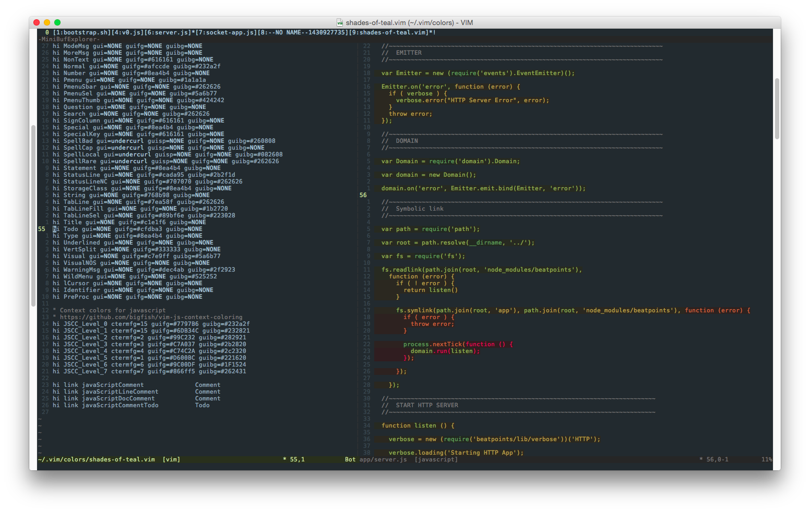

Shades of Teal
==============

A VIM colorscheme, for GUI's only.

the purpose of this scheme is to have colors that are uniform and offer a minimum of syntax emphasis. To me, it's not particularly interesting to differentiate heavily between keywords, conditions etc. I just want to be alerted if something is a string that I forgot to close or if I happen to be using a reserved word as a name. This scheme accomplishes that for me.

Combine it with Douglas Crockfords context sensitive coloring - [https://github.com/bigfish/vim-js-context-coloring](https://github.com/bigfish/vim-js-context-coloring) - where (to me) every level of callback is a bit more unfortunate than the previous, I run through increasingly alarming (and annoying) colors.

## Screenshot

## LICENSE
MIT
